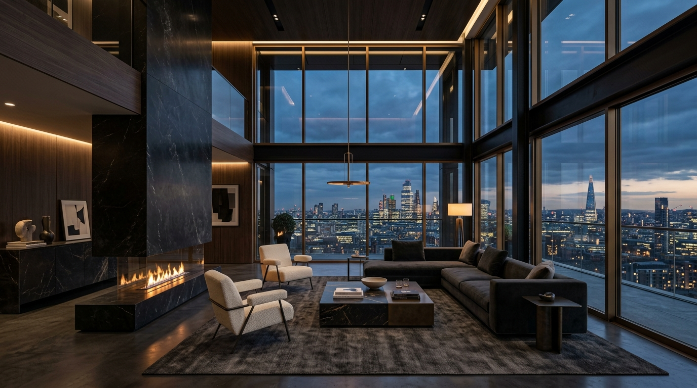

# The El Design House | Where Art, Function and Life Meet

An ultra-luxury architectural interior design studio web application showcasing bespoke residential sanctuaries and iconic commercial developments globally.



---

## 🏛️ Brand & Aesthetic
- **Theme**: Dark Luxury Architectural (`#09090b` obsidian, `#111115` charcoal noir, `#c5a059` champagne bronze, `#ffffff` Times New Roman typography).
- **Tagline**: *"WHERE ART, FUNCTION AND LIFE MEET."*

---

## ✨ Features

- **Hero & Studio Credentials**: Editorial typography, ambient lighting, and global delivery metrics.
- **About Us**: Studio ethos, vision, mission, and tactile materiality curation (Roman Travertine, Smoked Oak, Raw Bronze).
- **The 4-Stage Process**:
  - `01. BRIEFING` (Exhaustive questionnaire & lifestyle audit)
  - `02. DESIGN` (Moodboards, blueprints & 3D photorealistic models)
  - `03. EXECUTION` (End-to-end ground-up building & custom joinery)
  - `04. HANDOVER` (White-glove turnkey delivery)
- **Selected Works & Portfolio**: Filterable by `Residential` and `Commercial` with interactive case study detail modals.
- **Before & After Transformation Slider**: Interactive drag slider comparing raw concrete shells with finished architectural sanctuaries.
- **Scope & Timeline Estimator**: Interactive calculator estimating project duration and artisan crew size based on square footage and execution tier.
- **Appointment Booking System**: 4-step consultation scheduler with date/time slot selection, instant booking reference code (`ELDH-XXXXX`), and `localStorage` persistence.
- **Client Reviews & Live Review Submission**: Verified patron accolades with 5-star rating selector and live review publication.

---

## 📁 Project Structure

```
the-el-design-house/
├── index.html              # Main HTML5 application
├── styles.css              # Dark luxury architectural CSS design system
├── app.js                  # Core interactive JavaScript engine & portfolio database
├── HOW_TO_CUSTOMIZE.md     # Guide for changing images, tiles, and content
├── README.md               # Repository documentation
└── assets/
    └── images/             # High-resolution architectural photography
        ├── hero_interior.jpg
        ├── about_studio.jpg
        ├── process_models.jpg
        ├── res_obsidian_penthouse.jpg
        ├── comm_atelier_boutique.jpg
        ├── res_aethelgard_villa.jpg
        ├── comm_kuro_lounge.jpg
        ├── comm_omnia_hq.jpg
        ├── before_raw_space.jpg
        └── after_luxe_space.jpg
```

---

## 🚀 Getting Started

### Local Development
Open `index.html` in any modern web browser or run a local web server:

```bash
# Python
python -m http.server 8080

# Or with Node
npx serve .
```
Navigate to `http://localhost:8080`.

---

## 📄 License
© 2026 The El Design House. All Rights Reserved.
